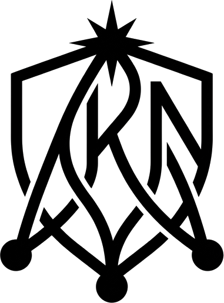

<div align="center">
  
  <h1>Alumni Knowledge Network</h1>
  <p>Connecting students with verified alumni for mentorship, career advice, and professional growth based on the SECI knowledge-sharing model.</p>
</div>

<br />

## About The Project

The Alumni Knowledge Network is a dedicated platform designed to bridge the gap between current students and successful alumni. By moving away from generic professional networks, this application focuses on structured mentorship and direct knowledge transfer within a trusted community.

### Core Features

- **Knowledge Feed**: A centralized space for alumni to share industry insights, experiences, and advice.
- **Mentorship System**: Students can request 1-on-1 mentorship from alumni based on industry and batch.
- **Verified Profiles**: Secure and verified accounts managed through Auth0 to maintain community integrity.
- **Admin Dashboard**: Role-based access control for superadmins to manage users and permissions.

## Tech Stack

- **Frontend**: Svelte 5, SvelteKit, Tailwind CSS v4
- **Backend**: NestJS, Prisma ORM
- **Database**: PostgreSQL (via Supabase/RDS)
- **Authentication**: Auth0
- **Hosting**: AWS Amplify (Frontend)

## Getting Started

Follow these steps to set up the project locally.

### Prerequisites

- Node.js (v20 or higher recommended)
- pnpm (v9+)
- PostgreSQL database

### Installation

1. **Clone the repository**
   ```bash
   git clone https://github.com/bgduque/alumni-knowledge-network.git
   cd alumni-knowledge-network
   ```

2. **Install dependencies**
   ```bash
   pnpm install
   ```

3. **Set up environment variables**
   
   Create `.env` files in both the `client` and `server` directories. See `.env.example` in each folder for the required keys.

   **Client (`client/.env`)**
   ```env
   VITE_AUTH0_DOMAIN=your-auth0-domain
   VITE_AUTH0_CLIENT_ID=your-auth0-client-id
   VITE_AUTH0_AUDIENCE=your-auth0-audience
   VITE_API_URL=http://localhost:3000/api
   ```

   **Server (`server/.env`)**
   ```env
   DATABASE_URL=your-postgres-url
   AUTH0_DOMAIN=your-auth0-domain
   AUTH0_AUDIENCE=your-auth0-audience
   ```

4. **Initialize the database**
   ```bash
   cd packages/database
   pnpm prisma db push
   pnpm prisma db seed
   ```

5. **Start the development servers**
   
   From the root of the project, run:
   ```bash
   pnpm dev
   ```
   This command starts both the SvelteKit frontend (port 5173) and the NestJS backend (port 3000) concurrently.

## Deployment

This project is configured for deployment on AWS Amplify. For detailed instructions on setting up the production environment, including SPA routing rules and CI/CD pipelines, please read the [AWS Amplify Deployment Guide](./AMPLIFY_DEPLOYMENT.md).

## Contributors

The development and design of this project were made possible by:

- **Aven**
- **Herky**
- **Boris**
- **Ang**

---
*Built for the alumni community.*
